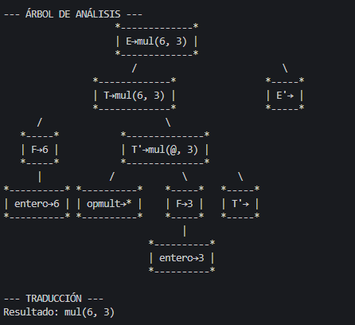
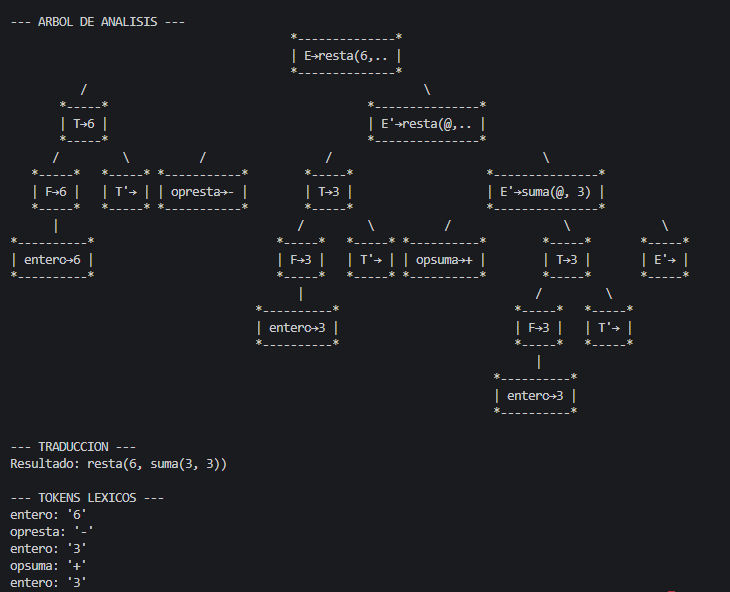

# Diseño de gramatica

```bash
E -> T E'
E' -> opsuma T E'
E' -> opresta T E'
E' -> ε
T -> F T'
T' -> opmult F T'
T' -> opdiv F T' 
T' -> ε
F -> parentesis_izq E 'parentesis_der
F -> entero
F -> decimal
```

## Gramatica de atributos

<table>
    <tr> 
        <td> Gramatica
<pre><code>
E -> T E' {E.traduccion= if E'.traduccion=="":
                T.traduccion
              else:
                E'.traduccion.unir(T.traduccion)}
E' -> opsuma T E' { E'.traduccion="suma("||T.traduccion||","||E1'.traduccion||")" }
E' -> opresta T E'{ E'.traduccion="resta("||T.traduccion||","||E1'.traduccion||")"}
E' -> ε {E'.traduccion=""}
T -> F T' { T.traduccion= if T'.traduccion == "":
                F.traduccion
              else:
                T'.traduccion.unir(F.traduccion) }
T' -> opmult F T' {T'.traduccion= "mul("||F.traduccion||","||T1'.traduccion||")"}
T' -> opdiv F T' { T'.traduccion="div("||F.traduccion||","||T1'.traduccion||")"}
T' -> ε {T'.traduccion=""}
F ->  parentesis_izq E parentesis_der {F.traduccion="("|| E.traduccion ||")"}
F -> entero { F.traduccion=entero.lexema}
F -> decimal F.traduccion=decimal.lexema
</table>


# Uso del programa

Este script permite mediante una gramatica predefinida, realizar un parseo,lexer y generar un Esquema de Traduccion Dirigida por Sintaxis, definimos los atritubos sintetizados en el diseño de la gramatica y se implemento en el codigo para el parser recursivo. Mediante una libreria creada, se impre el arbol decorado, con la semantica y los simbolos no terminales.


# Ejemplo de cadenas

```bash

python .\main.py .\grammar.txt 6*3

```


```bash
python .\main.py .\grammar.txt 6-3+3
```
